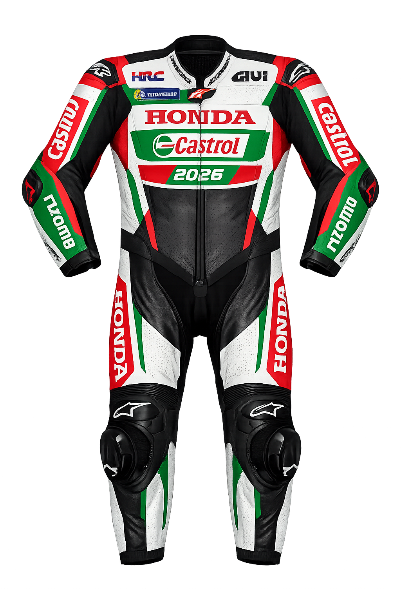

# 🐈 CatVTON: Concatenation Is All You Need for Virtual Try-On with Diffusion Models

<div style="display: flex; justify-content: center; align-items: center;">
  <a href="http://arxiv.org/abs/2407.15886" style="margin: 0 2px;">
    
  </a>
  <a href='https://huggingface.co/zhengchong/CatVTON' style="margin: 0 2px;">
    
  </a>
  <a href="https://github.com/Zheng-Chong/CatVTON" style="margin: 0 2px;">
    
  </a>
  <a href="http://120.76.142.206:8888" style="margin: 0 2px;">
    
  </a>
  <a href="https://huggingface.co/spaces/zhengchong/CatVTON" style="margin: 0 2px;">
    
  </a>
  <a href='https://zheng-chong.github.io/CatVTON/' style="margin: 0 2px;">
    
  </a>
  <a href="https://github.com/Zheng-Chong/CatVTON/LICENCE" style="margin: 0 2px;">
    
  </a>
</div>


**CatVTON** is a simple and efficient virtual try-on diffusion model with ***1) Lightweight Network (899.06M parameters totally)***, ***2) Parameter-Efficient Training (49.57M parameters trainable)*** and ***3) Simplified Inference (< 8G VRAM for 1024X768 resolution)***.
<div align="center">
  
</div>


---

# 🚀 Antigravity Live Studio v3.0 (Pro-Control Edition)
**High-Fidelity | Identity Anchoring | Live Studio Previews | Scientific Spatial Constraints**

We have significantly modified the original CatVTON engine, creating a production-grade evolution of the open-source Virtual Try-On paradigm. It solves the fundamental limitations of latent diffusion (hallucinations, cape artifacts, text destruction) by wrapping the core neural engine in a **Custom Mathematical Architecture**. 

Engineered specifically for Apple Silicon (MPS), the engine is mathematically stabilized with dynamic safety clamps to prevent crashes, alongside an entirely new suite of post-processing VFX tools for exact visual preservation.

## 🏛️ The Centralized Neural Hub Architecture

To prevent duplicate 10GB+ neural network downloads across different AI projects, **this repository enforces a Centralized Neural Hub**.

By default, the engine requires all AI models to live at a specific absolute path on your machine:
📁 **`/Users/Shared/Models/`**

### ⚠️ If you are on Windows or Linux:
You **must** modify the `_MODELS_ROOT` path in the source code to match your operating system, or use a UNIX-like path mapping.
1. Open `app.py`.
2. Locate Line 51: `_MODELS_ROOT = Path("/Users/Shared/Models")`
3. Change this to your preferred universal model directory (e.g., `C:/Shared/Models` or `/home/user/Models`).

---

## 🚀 Quick Start
1. **Initialize Engine**: Run the installer to prepare your environment and verify neural weights. The script will automatically construct the Centralized Hub and use `huggingface-cli` to securely download the hundreds of megabytes of required weights directly into it.
   ```bash
   chmod +x install.sh run.sh
   ./install.sh
   ```
2. **Launch Studio**:
   ```bash
   ./run.sh
   ```

---

## 💎 V3.0 Pro Features
- **Surgical Head Paste**: Extracts your exact face, hair, and sunglasses from the original photo and alpha-blends it pixel-perfectly onto the final AI generation. 100% molecular originality guaranteed.
- **LCM Safety Circuit Break**: Mathematical engine interlock that perfectly bounds Guidance Scale under `2.0` when running Fast Drafts (LCM), making "deep-fried" crashes impossible.
- **Auto-Preset Snap System**: Toggling between Fast Draft and High Quality instantly configures all 7 hidden sliders (Steps, Guidance, Padding, Blend, Sampler) to their mathematically optimal safe zones.
- **Deep Clean Plate**: A true green-screen mode. Automatically calculates the silhouette of your entire body *after* generation to securely isolate the Try-On from your provided untouched background without clipping.
- **Mask Dilation Engine**: Custom padding parameters (-10 to +30) to surgically expand AI rendering zones and completely eradicate original clothing "ghosting."
- **Fractional Face Restoration**: Variable GFPGAN slider allowing you to seamlessly mix your original skin pores and freckles alongside AI face-symmetry enhancements.
- **Karras Optimization**: The backend now natively overrides standard rendering by substituting `DPM++ 2M Karras` to maximize micro-texture clarity at 30+ steps.

---

## 🧬 Scientific Overview: How We Fixed Virtual Try-On

Standard zero-shot image-conditioned diffusion networks (like CatVTON or OOTDiffusion) suffer from massive mathematical flaws. This repository fixes them using post-process Computer Vision and Spatial Hacks.

### 1. The "Cape" Artifact Fix (DensePose Hacking)
**The Problem:** Neural engines calculate a "Convex Hull" (a rubber band stretched around your body). If your arms are raised, the hull creates massive empty white triangles between your arms and torso. The AI fills this empty space with hallucinated fabric, creating weird "capes".
**Our Solution:** We hacked the core `cloth_masker.py` to completely eradicate the Convex Hull logic. The engine now strictly enforces **Body-Hugging DensePose Arrays**, physically banning the AI from generating fabric in the empty air between limbs.

### 2. Garment Cut Constraints (Spatial Limitations)
**The Problem:** Image-conditioned AI cannot read text prompts (e.g., you cannot type "tank top" to force it to remove sleeves).
**Our Solution:** We intercept the neural DensePose map *before* generation. If you select "Sleeveless" in our UI, the backend mathematically deletes the `big arms` and `forearms` data arrays from the canvas. The AI is physically blocked from drawing sleeves.

### 3. Deep Logo & Texture Restoration (TPS Warp)
**The Problem:** Latent Diffusion auto-encoders inherently destroy high-frequency text, logos, and sharp graphics.
**Our Solution:** We built a custom **Thin-Plate Spline (TPS) Warp Engine** powered by OpenCV. 
1. It mathematically anchors 50+ spatial geometry points on your generated torso.
2. It warps the *original, high-res* flat garment onto the 3D curves of the generated body.
3. It performs a High-Pass Frequency Separation, blending the sharp 4K graphics of the original image with the 3D lighting/shadows of the AI generation.

---

## 📁 System Map
- `app.py`: The single-file Live Studio engine and UI architecture.
- `/Users/Shared/Models/`: Central neural vault for all isolated AI weights globally.
- `vendor/`: Core localized dependencies for CatVTON and Detectron2 isolated from upstream pipeline regressions.

## 🛠️ Advanced Operations
- **Fast Draft (8 Steps)**: Will execute instantly, but is restricted to testing physical clothing fit and proportion. (Ignore the harmless Diffusers console warnings).
- **High Quality (30+ Steps)**: Triggers the `DPM++ 2M Karras` scheduler and unlocks deep texture unsharp masking and Surgical Head features.

---
*Developed with 🛡️ by Antigravity*

---

## Updates
- **`2024/08/10`**: Our 🤗 [**HuggingFace Space**](https://huggingface.co/spaces/zhengchong/CatVTON) is available now! Thanks for the grant from [**ZeroGPU**](https://huggingface.co/zero-gpu-explorers)！
- **`2024/08/09`**: [**Evaluation code**](https://github.com/Zheng-Chong/CatVTON?tab=readme-ov-file#3-calculate-metrics) is provided to calculate metrics 📚.
- **`2024/07/27`**: We provide code and workflow for deploying CatVTON on [**ComfyUI**](https://github.com/Zheng-Chong/CatVTON?tab=readme-ov-file#comfyui-workflow) 💥.
- **`2024/07/24`**: Our [**Paper on ArXiv**](http://arxiv.org/abs/2407.15886) is available 🥳!
- **`2024/07/22`**: Our [**App Code**](https://github.com/Zheng-Chong/CatVTON/blob/main/app.py) is released, deploy and enjoy CatVTON on your mechine 🎉!
- **`2024/07/21`**: Our [**Inference Code**](https://github.com/Zheng-Chong/CatVTON/blob/main/inference.py) and [**Weights** 🤗](https://huggingface.co/zhengchong/CatVTON) are released.
- **`2024/07/11`**: Our [**Online Demo**](http://120.76.142.206:8888) is released 😁.


## Installation
An [Installation Guide](https://github.com/Zheng-Chong/CatVTON/blob/main/INSTALL.md) is provided to help build the conda environment for CatVTON. When deploying the app, you will need Detectron2 & DensePose, which are not required for inference on datasets. Install the packages according to your needs.

## Deployment 
### ComfyUI Workflow
We have modified the main code to enable easy deployment of CatVTON on [ComfyUI](https://github.com/comfyanonymous/ComfyUI). Due to the incompatibility of the code structure, we have released this part in the [Releases](https://github.com/Zheng-Chong/CatVTON/releases/tag/ComfyUI), which includes the code placed under `custom_nodes` of ComfyUI and our workflow JSON files.

To deploy CatVTON to your ComfyUI, follow these steps:
1. Install all the requirements for both CatVTON and ComfyUI, refer to [Installation Guide for CatVTON](https://github.com/Zheng-Chong/CatVTON/blob/main/INSTALL.md) and [Installation Guide for ComfyUI](https://github.com/comfyanonymous/ComfyUI?tab=readme-ov-file#installing).
2. Download [`ComfyUI-CatVTON.zip`](https://github.com/Zheng-Chong/CatVTON/releases/download/ComfyUI/ComfyUI-CatVTON.zip) and unzip it in the `custom_nodes` folder under your ComfyUI project (clone from [ComfyUI](https://github.com/comfyanonymous/ComfyUI)).
3. Run the ComfyUI.
4. Download [`catvton_workflow.json`](https://github.com/Zheng-Chong/CatVTON/releases/download/ComfyUI/catvton_workflow.json) and drag it into you ComfyUI webpage and enjoy 😆!

> Problems under Windows OS, please refer to [issue#8](https://github.com/Zheng-Chong/CatVTON/issues/8).
> 
When you run the CatVTON workflow for the first time, the weight files will be automatically downloaded, usually taking dozens of minutes.

<div align="center">
  
</div>

<!-- <div align="center">
 
</div> -->

### Gradio App

To deploy the Gradio App for CatVTON on your machine, run the following command, and checkpoints will be automatically downloaded from HuggingFace.

```PowerShell
CUDA_VISIBLE_DEVICES=0 python app.py \
--output_dir="resource/demo/output" \
--mixed_precision="bf16" \
--allow_tf32 
```
When using `bf16` precision, generating results with a resolution of `1024x768` only requires about `8G` VRAM.

## Inference
### 1. Data Preparation
Before inference, you need to download the [VITON-HD](https://github.com/shadow2496/VITON-HD) or [DressCode](https://github.com/aimagelab/dress-code) dataset.
Once the datasets are downloaded, the folder structures should look like these:
```
├── VITON-HD
|   ├── test_pairs_unpaired.txt
│   ├── test
|   |   ├── image
│   │   │   ├── [000006_00.jpg | 000008_00.jpg | ...]
│   │   ├── cloth
│   │   │   ├── [000006_00.jpg | 000008_00.jpg | ...]
│   │   ├── agnostic-mask
│   │   │   ├── [000006_00_mask.png | 000008_00.png | ...]
...
```

```
├── DressCode
|   ├── test_pairs_paired.txt
|   ├── test_pairs_unpaired.txt
│   ├── [dresses | lower_body | upper_body]
|   |   ├── test_pairs_paired.txt
|   |   ├── test_pairs_unpaired.txt
│   │   ├── images
│   │   │   ├── [013563_0.jpg | 013563_1.jpg | 013564_0.jpg | 013564_1.jpg | ...]
│   │   ├── agnostic_masks
│   │   │   ├── [013563_0.png| 013564_0.png | ...]
...
```
For the DressCode dataset, we provide script to preprocessed agnostic masks, run the following command:
```PowerShell
CUDA_VISIBLE_DEVICES=0 python preprocess_agnostic_mask.py \
--data_root_path <your_path_to_DressCode> 
```

### 2. Inference on VTIONHD/DressCode
To run the inference on the DressCode or VITON-HD dataset, run the following command, checkpoints will be automatically downloaded from HuggingFace.

```PowerShell
CUDA_VISIBLE_DEVICES=0 python inference.py \
--dataset [dresscode | vitonhd] \
--data_root_path <path> \
--output_dir <path> 
--dataloader_num_workers 8 \
--batch_size 8 \
--seed 555 \
--mixed_precision [no | fp16 | bf16] \
--allow_tf32 \
--repaint \
--eval_pair  
```
### 3. Calculate Metrics

After obtaining the inference results, calculate the metrics using the following command: 

```PowerShell
CUDA_VISIBLE_DEVICES=0 python eval.py \
--gt_folder <your_path_to_gt_image_folder> \
--pred_folder <your_path_to_predicted_image_folder> \
--paired \
--batch_size=16 \
--num_workers=16 
```

-  `--gt_folder` and `--pred_folder` should be folders that contain **only images**.
- To evaluate the results in a paired setting, use `--paired`; for an unpaired setting, simply omit it.
- `--batch_size` and `--num_workers` should be adjusted based on your machine.


## Acknowledgement
Our code is modified based on [Diffusers](https://github.com/huggingface/diffusers). We adopt [Stable Diffusion v1.5 inpainting](https://huggingface.co/runwayml/stable-diffusion-inpainting) as the base model. We use [SCHP](https://github.com/GoGoDuck912/Self-Correction-Human-Parsing/tree/master) and [DensePose](https://github.com/facebookresearch/DensePose) to automatically generate masks in our [Gradio](https://github.com/gradio-app/gradio) App and [ComfyUI](https://github.com/comfyanonymous/ComfyUI) workflow. Thanks to all the contributors!

## License
All the materials, including code, checkpoints, and demo, are made available under the [Creative Commons BY-NC-SA 4.0](https://creativecommons.org/licenses/by-nc-sa/4.0/) license. You are free to copy, redistribute, remix, transform, and build upon the project for non-commercial purposes, as long as you give appropriate credit and distribute your contributions under the same license.


## Citation

```bibtex
@misc{chong2024catvtonconcatenationneedvirtual,
 title={CatVTON: Concatenation Is All You Need for Virtual Try-On with Diffusion Models}, 
 author={Zheng Chong and Xiao Dong and Haoxiang Li and Shiyue Zhang and Wenqing Zhang and Xujie Zhang and Hanqing Zhao and Xiaodan Liang},
 year={2024},
 eprint={2407.15886},
 archivePrefix={arXiv},
 primaryClass={cs.CV},
 url={https://arxiv.org/abs/2407.15886}, 
}
```

## 📸 Image Gallery & Examples

### Perfect Racing Suit Alignment (TPS Warp + Cut Constraints)
<div align="center">
  
</div>

*The custom TPS Warp mathematically anchors the Castrol and Honda logos to the generated body geometry, completely preserving them from Latent Diffusion destruction. The 'shorts' length constraint was engaged to perfectly map the pants.*

### Everyday Wear
<div align="center">
  
</div>

### Original Assets
* **Original Garment:** `images/garment_example.png`
* **Original Person:** `images/person_example.png`
